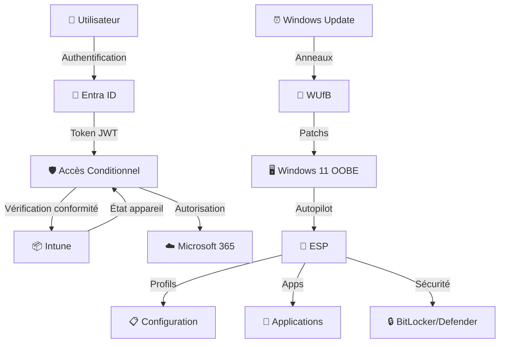
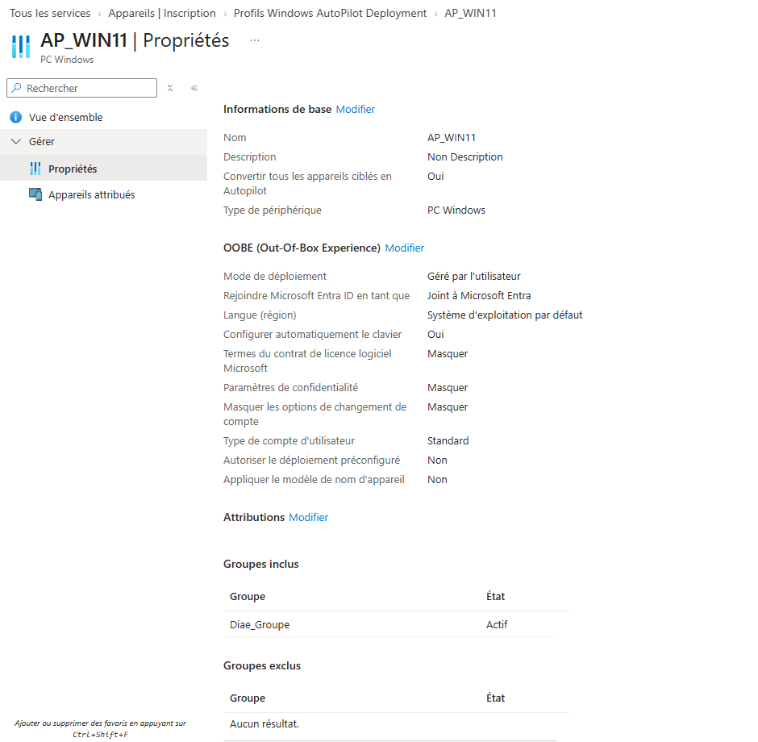
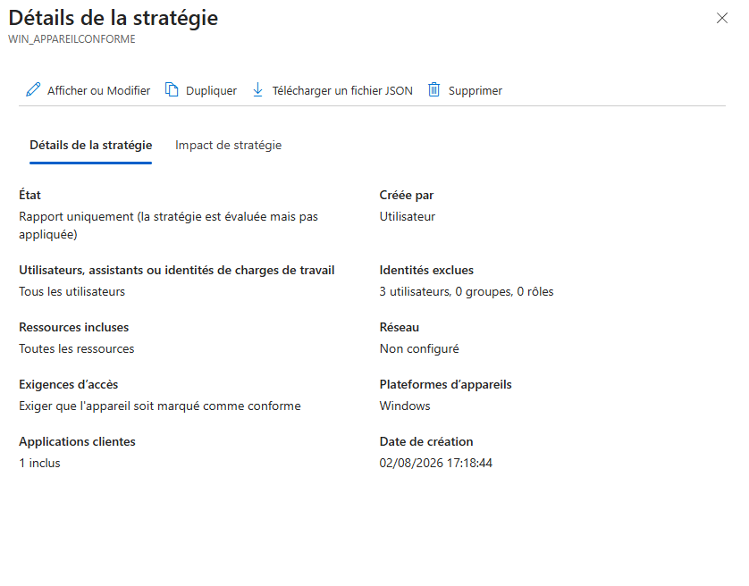
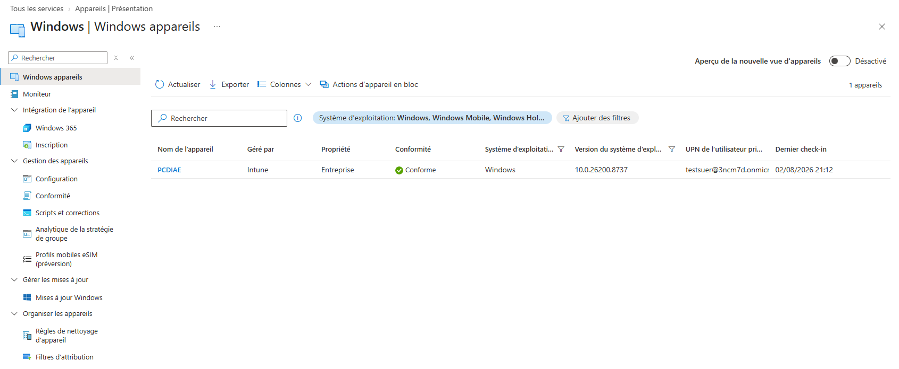
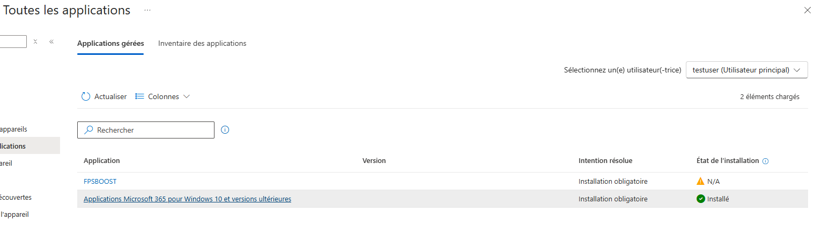

<div align="center">

# 🌐 Entra-Intune-Enterprise-Architecture

### Lab de Déploiement Modern Workplace & Zéro Trust

[](https://www.microsoft.com/microsoft-365)
[](https://azure.microsoft.com/services/active-directory/)
[](https://docs.microsoft.com/mem/intune/)
[](https://www.microsoft.com/windows/windows-11)
[](https://docs.microsoft.com/learn/certifications/exams/md-102)
[](LICENSE)

<p align="center">
  
</p>

**Architecture complète Microsoft 365 / Entra ID / Intune pour la gestion, la sécurisation et l'automatisation du cycle de vie des postes Windows 11 en mode Zéro Trust.**


</div>

---

## 📋 Table des matières

- [📌 Présentation](#-pr%C3%A9sentation)
- [🏗️ Architecture & Flux de Gestion](#%EF%B8%8F-architecture--flux-de-gestion)
- [🛠️ Étapes de Mise en Œuvre](#%EF%B8%8F-%C3%A9tapes-de-mise-en-%C5%93uvre)
  - [1. Infrastructure Cloud & Identité](#1-infrastructure-cloud--identit%C3%A9)
  - [2. Provisioning & Enrôlement Automatisé](#2-provisioning--enr%C3%B4lement-automatis%C3%A9)
  - [3. Architecture Zéro Trust](#3-architecture-z%C3%A9ro-trust)
  - [4. Sécurité du Poste de Travail](#4-s%C3%A9curit%C3%A9-du-poste-de-travail)
  - [5. Gestion & Déploiement d'Applications](#5-gestion--d%C3%A9ploiement-dapplications)
  - [6. Patch Management & Cycle de Vie](#6-patch-management--cycle-de-vie)
- [🧪 Validation & PoC](#-validation--poc)
- [📸 Screenshots](#-screenshots)
- [🛡️ Matrice de Conformité](#%EF%B8%8F-matrice-de-conformit%C3%A9)
- [🔧 Scripts & Ressources](#-scripts--ressources)
- [📚 Références](#-r%C3%A9f%C3%A9rences)
- [👤 Auteur](#-auteur)

---

## 📌 Présentation

Ce projet documente la **conception et le déploiement complet** d'une architecture Microsoft 365 / Entra ID / Intune pour une entreprise moderne. L'objectif est de gérer, sécuriser et automatiser le **cycle de vie complet des postes de travail Windows 11** selon les exigences de sécurité **Zéro Trust** et les standards de l'examen **Microsoft MD-102** (Endpoint Administrator).

### 🎯 Objectifs

| Objectif | Description | Statut |
|----------|-------------|--------|
| 🔐 **Sécurité Zéro Trust** | Aucun accès par défaut, vérification continue | ✅ |
| 🤖 **Automatisation** | Déploiement sans intervention IT | ✅ |
| 📱 **Modern Management** | Gestion cloud-native des endpoints | ✅ |
| 🛡️ **Conformité** | Respect des standards MD-102 & sécurité entreprise | ✅ |
| ⚡ **Expérience Utilisateur** | Onboarding fluide et rapide | ✅ |

### 🏢 Contexte

- **Environnement** : Microsoft 365 E5
- **Cible** : Postes Windows 11 Pro/Entreprise
- **Méthodologie** : Cloud-native, User-Driven
- **Framework** : Microsoft Zéro Trust Architecture

---

## 🏗️ Architecture & Flux de Gestion

```
┌─────────────────────────────────────────────────────────────────────────────┐
│                         🌐 TENANT MICROSOFT 365                              │
└─────────────────────────────────────────────────────────────────────────────┘
                                      │
        ┌─────────────────────────────┼─────────────────────────────┐
        ▼                             ▼                             ▼
┌───────────────┐           ┌─────────────────┐           ┌─────────────────┐
│   🔷 Entra ID  │           │  📦 Intune MDM   │           │  🔄 Autopilot   │
│   Identités    │◄─────────►│   Gestion        │◄─────────►│   Provisioning  │
│   & Groupes    │           │   Appareils      │           │   OOBE          │
└───────────────┘           └─────────────────┘           └─────────────────┘
        │                             │                             │
        ▼                             ▼                             ▼
┌───────────────┐           ┌─────────────────┐           ┌─────────────────┐
│ 👥 Groupes    │           │ 📋 Stratégies   │           │ 🖥️ ESP          │
│ Dynamiques    │           │ Conformité      │           │ (Enrollment     │
│ (Départements)│           │ & Configuration │           │  Status Page)   │
└───────────────┘           └─────────────────┘           └─────────────────┘
        │                             │                             │
        └─────────────────────────────┼─────────────────────────────┘
                                      ▼
                    ┌─────────────────────────────────┐
                    │      🛡️ ACCÈS CONDITIONNEL       │
                    │   Zéro Trust - Appareil Conforme  │
                    └─────────────────────────────────┘
                                      │
        ┌─────────────────────────────┼─────────────────────────────┐
        ▼                             ▼                             ▼
┌───────────────┐           ┌─────────────────┐           ┌─────────────────┐
│ 📱 Applications│           │  🔒 Sécurité    │           │  🔄 Maintenance  │
│ M365 + Win32  │           │  BitLocker      │           │  WUfB Rings     │
│               │           │  Defender       │           │  Feature/QoL    │
└───────────────┘           └─────────────────┘           └─────────────────┘
```

### 🔀 Flux de Données



---

## 🛠️ Étapes de Mise en Œuvre

### 1. Infrastructure Cloud & Identité (Microsoft Entra ID)

#### 🏢 Création du Tenant M365
- Configuration initiale du locataire cloud
- Attribution des licences **Microsoft 365 E5**
- Configuration des domaines personnalisés
- Mise en place de la fédération d'identité (optionnel)

#### 👥 Gestion des Identités

| Élément | Configuration | Objectif |
|---------|--------------|----------|
| **Utilisateurs** | Création comptes test + admin | Tests et administration |
| **Groupes Dynamiques** | `Diae_Groupe` | Automatisation du ciblage |
| **Règles d'appartenance** | Département, Poste, Localisation | Attribution automatique |

**Exemple de règle de groupe dynamique :**
```powershell
(user.department -eq "IT") -and (user.jobTitle -contains "Technicien")
```

---

### 2. Provisioning & Enrôlement Automatisé (Windows Autopilot)

#### 📋 Configuration de l'ESP (Enrollment Status Page)

| Paramètre | Valeur | Justification |
|-----------|--------|---------------|
| **Blocage bureau** | ✅ Activé | Sécurité : pas d'accès tant que tout n'est pas installé |
| **Options dépannage** | ✅ Activées | Autonomie utilisateur |
| **Réinitialisation** | ✅ Activée | Capacité de recovery |
| **Timeout** | 60 minutes | Éviter blocages infinis |

#### 🚀 Profil de Déploiement Autopilot (`AP_WIN11_UserDriven`)

```yaml
Profil: AP_WIN11_UserDriven
Mode: User-Driven
Jonction: Microsoft Entra ID Join (Native)
OOBE:
  - Masquage EULA: true
  - Masquage Privacy Settings: true
  - Masquage Account Setup: true
  - Langue: Français (France)
Compte local: Standard User (Principe moindre privilège)
White Glove: Non activé
Device Name Template: "W11-%SERIAL%"
```

---

### 3. Architecture Zéro Trust : Conformité & Accès Conditionnel

#### 🔒 Stratégie de Conformité Windows 11 (`COMP_WIN11_ExigenceSecurite`)

| Catégorie | Exigence | Niveau |
|-----------|----------|--------|
| **Chiffrement** | BitLocker activé (TPM 2.0 requis) | 🔴 Critique |
| **Pare-feu** | Windows Firewall activé | 🔴 Critique |
| **Antivirus** | Microsoft Defender Antivirus actif | 🔴 Critique |
| **Démarrage sécurisé** | Secure Boot activé | 🔴 Critique |
| **Intégrité du code** | Code Integrity (HVCI) | 🟡 Recommandé |
| **Version OS** | Windows 11 22H2 minimum | 🟡 Recommandé |

#### 🛡️ Accès Conditionnel Entra ID (`CA_WIN11_ExigerAppareilConforme`)

```json
{
  "nom": "CA_WIN11_ExigerAppareilConforme",
  "état": "Activé",
  "cibles": {
    "utilisateurs": "Tous les utilisateurs",
    "applications": "Microsoft 365 cloud apps"
  },
  "conditions": {
    "plateformes": ["Windows"],
    "applications_client": "Toutes"
  },
  "contrôles": {
    "appareil_conforme": "Requis",
    "action_non_conforme": "Bloquer l'accès",
    "message": "Votre appareil doit être conforme pour accéder aux ressources d'entreprise."
  }
}
```

> ⚠️ **Principe Zéro Trust** : Si l'appareil n'est pas marqué **Conforme** dans Intune → **Accès bloqué** aux données d'entreprise.

---

### 4. Sécurité du Poste de Travail (Settings Catalog)

#### ⚙️ Profil de Configuration Administrative

| Paramètre | Chemin | Valeur |
|-----------|--------|--------|
| **USB Restriction** | `DeviceInstallation/RestrictDeviceInstallation` | Bloqué |
| **OneDrive Personnel** | `OneDrive/DisablePersonalSync` | Activé (bloqué) |
| **Cortana Entreprise** | `Experience/AllowCortana` | Désactivé |
| **Windows Store** | `ApplicationManagement/RequirePrivateStoreOnly` | Activé |
| **Télémétrie** | `System/AllowTelemetry` | Sécurité (niveau 0) |
| **Mot de passe** | `DeviceLock/MinPasswordLength` | 12 caractères |
| **Écran de verrouillage** | `DeviceLock/EnforceLockScreen` | 5 minutes |

---

### 5. Gestion & Déploiement d'Applications (MAM / MDM)

#### 📦 Microsoft 365 Apps for Enterprise

| Application | Canal | Version | Architecture |
|-------------|-------|---------|--------------|
| Word | Current Channel | Dernière | x64 |
| Excel | Current Channel | Dernière | x64 |
| PowerPoint | Current Channel | Dernière | x64 |
| Outlook | Current Channel | Dernière | x64 |
| Teams | Current Channel | Dernière | x64 |
| OneDrive Entreprise | Current Channel | Dernière | x64 |

**Configuration XML (exemple) :**
```xml
<Configuration>
  <Add OfficeClientEdition="64" Channel="Current">
    <Product ID="O365ProPlusRetail">
      <Language ID="fr-fr" />
      <ExcludeApp ID="Lync" />
      <ExcludeApp ID="Groove" />
    </Product>
  </Add>
  <Updates Enabled="TRUE" Channel="Current" />
  <Display Level="None" AcceptEULA="TRUE" />
</Configuration>
```

#### 🎮 Application Métier Win32 Custom (`FPSBoostPro`)

| Étape | Outil / Script | Description |
|-------|---------------|-------------|
| **Packaging** | `IntuneWinAppUtil.exe` | Conversion en `.intunewin` |
| **Détection** | `Detect-FPSBoostPro.ps1` | Vérification présence & version |
| **Installation** | `Install-FPSBoostPro.ps1` | Déploiement silencieux |
| **Désinstallation** | `Uninstall-FPSBoostPro.ps1` | Nettoyage complet |

**Script de détection PowerShell (`Detect-FPSBoostPro.ps1`) :**
```powershell
#Requires -Version 5.1
<#
.SYNOPSIS
    Script de détection Intune pour FPSBoostPro
.DESCRIPTION
    Vérifie la présence, la version et l'intégrité de l'application
#>

$AppName = "FPSBoostPro"
$ExpectedVersion = "2.5.1"
$InstallPath = "${env:ProgramFiles}\FPSBoostPro\FPSBoostPro.exe"

try {
    if (Test-Path $InstallPath) {
        $FileVersion = (Get-ItemProperty $InstallPath).VersionInfo.FileVersion
        if ($FileVersion -ge $ExpectedVersion) {
            Write-Output "Application detectee - Version: $FileVersion"
            exit 0  # Conforme
        } else {
            Write-Output "Version obsolete: $FileVersion (attendue: $ExpectedVersion)"
            exit 1  # Non conforme
        }
    } else {
        Write-Output "Application non installee"
        exit 1  # Non installee
    }
} catch {
    Write-Output "Erreur de detection: $_"
    exit 1
}
```

---

### 6. Patch Management & Cycle de Vie (Update Rings)

#### 🔄 Stratégie Windows Update for Business (`UPD_WIN11_AnneauTest`)

| Type de Mise à Jour | Période de Report | Justification |
|---------------------|-------------------|---------------|
| **Qualité (Sécurité)** | **0 jour** | Application immédiate des correctifs critiques |
| **Fonctionnalités** | **2 jours** | Validation de stabilité avant déploiement |
| **Pilotes** | **5 jours** | Éviter les régressions matérielles |

#### ⚙️ Paramètres Utilisateur

```yaml
Installation: Automatique
Horaires maintenance: 02:00 - 04:00
Redémarrage: Forcé après 15 minutes de notification
Pause utilisateur: Désactivée
Délai qualité max: 7 jours
Délai feature max: 14 jours
```

---

## 🧪 Validation & PoC

Le déploiement a été validé sur des **machines virtuelles Windows 11 Pro/Entreprise** dans un environnement isolé.

### ✅ Tests Réalisés

| Test | Scénario | Résultat |
|------|----------|----------|
| 🔐 **Autopilot OOBE** | Premier démarrage utilisateur | ✅ Jonction Entra ID sans IT |
| 📱 **ESP** | Blocage jusqu'à complétion | ✅ Applications installées avant bureau |
| 🛡️ **Conformité** | Appareil non conforme | ✅ Accès bloqué aux ressources M365 |
| 📦 **Applications** | Déploiement M365 + Win32 | ✅ Installation silencieuse |
| 🔒 **BitLocker** | Chiffrement automatique | ✅ TPM + Recovery Key dans Entra ID |
| 🔄 **WUfB** | Patch Tuesday simulé | ✅ Application dans les 24h |
| 🔌 **USB** | Insertion clé USB | ✅ Accès bloqué par GPO Intune |

### 📊 Résultats Audit Intune

```
Appareil: W11-VM-TEST-01
Statut: ✅ Conforme (Compliant)
Dernière vérification: 01-08-2026 14:32 

├─ Conformité: PASS
├─ Configuration: PASS  
├─ Applications: PASS
├─ Mises à jour: PASS
└─ Sécurité: PASS
```

---

## 📸 Screenshots

> *Les captures d'écran ci-dessous illustrent les étapes clés du déploiement.*

### 📋 Profil Autopilot




### 🛡️ Accès Conditionnel



### ✅ Statut de Conformité




### 🖥️ Application deployé



---

## 🛡️ Matrice de Conformité

| Standard | Exigence | Implémenté | Preuve |
|----------|----------|------------|--------|
| **ISO 27001** | Contrôle d'accès logique | ✅ | Accès Conditionnel |
| **ISO 27001** | Chiffrement des données | ✅ | BitLocker |
| **NIST ZTA** | Vérification continue | ✅ | Device Compliance |
| **MD-102** | Gestion des endpoints | ✅ | Intune MDM |
| **MD-102** | Autopilot & ESP | ✅ | Profil configuré |
| **MD-102** | Update Rings | ✅ | WUfB configuré |
| **RGPD** | Traçabilité | ✅ | Audit logs Entra ID |

---

## 🔧 Scripts & Ressources

### 📁 Structure du Repository

```
📦 Entra-Intune-Enterprise-Architecture
├── 📁 scripts/
│   ├── 📄 Detect-FPSBoostPro.ps1
│   ├── 📄 Install-FPSBoostPro.ps1
│   ├── 📄 Uninstall-FPSBoostPro.ps1
│   └── 📄 Export-IntuneConfig.ps1
├── 📁 configs/
│   ├── 📄 AP_WIN11_UserDriven.json
│   ├── 📄 COMP_WIN11_ExigenceSecurite.json
│   ├── 📄 CA_WIN11_ExigerAppareilConforme.json
│   └── 📄 UPD_WIN11_AnneauTest.json
├── 📁 docs/
│   ├── 📄 architecture.md
│   ├── 📄 troubleshooting.md
│   └── 📄 runbook.md
├── 📁 images/
│   ├── 🖼️ architecture-diagram.png
│   ├── 🖼️ intune-dashboard.png
│   └── 🖼️ autopilot-flow.png
└── 📄 README.md
```

### 🚀 Commandes Utiles

```powershell
# Exporter la configuration Intune
Export-IntuneConfig -Path "./backup"

# Vérifier la conformité d'un appareil
Get-IntuneManagedDevice -Filter "deviceName eq 'W11-VM-TEST-01'" | Select complianceState

# Forcer une synchronisation MDM
Invoke-DeviceAction -DeviceId $deviceId -Action syncDevice
```

---

## 📚 Références

- [📖 Microsoft Intune Documentation](https://docs.microsoft.com/mem/intune/)
- [🔷 Microsoft Entra ID Documentation](https://docs.microsoft.com/azure/active-directory/)
- [🖥️ Windows Autopilot Documentation](https://docs.microsoft.com/windows/deployment/windows-autopilot/)
- [🛡️ Microsoft Zéro Trust Architecture](https://www.microsoft.com/security/blog/zero-trust/)
- [🎓 Examen MD-102](https://docs.microsoft.com/learn/certifications/exams/md-102)
- [📦 Win32 Content Prep Tool](https://github.com/microsoft/Microsoft-Win32-Content-Prep-Tool)

---

## 👤 Auteur

**Diae**
- 💼 *Administrateur Systèmes & Cloud*
- 🎓 *Certifié Microsoft SC-900/MD-102*
- 💼 *Linkedin* https://www.linkedin.com/in/diaedarraz

---

<div align="center">

### ⭐ Si ce projet vous a été utile, n'hésitez pas à mettre une étoile !

**[⬆ Retour en haut](#-entra-intune-enterprise-architecture)**

</div>
